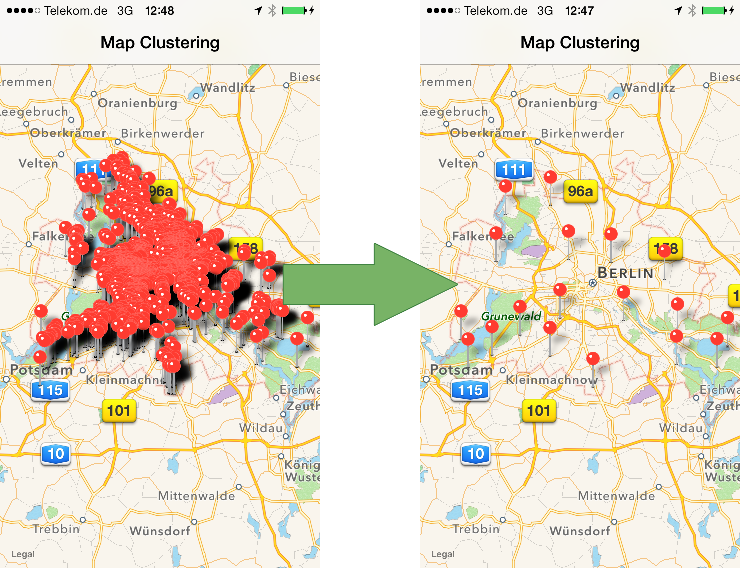

CCHMapClusterController
=======================

[](https://travis-ci.org/choefele/CCHMapClusterController)

If you have your project set up with an `MKMapView`, integrating clustering will take 4 lines of code:

<pre>
<b>#import "CCHMapClusterController.h"</b>
  
@interface ViewController()

<b>@property (strong, nonatomic) CCHMapClusterController *mapClusterController;</b>

@end

- (void)viewDidLoad
{
  [super viewDidLoad]
    
  NSArray annotations = ...
  <b>self.mapClusterController = [[CCHMapClusterController alloc] initWithMapView:self.mapView];
  [self.mapClusterController addAnnotations:annotations withCompletionHandler:NULL];</b>
}
</pre>

<p align="center" >
  
</p>

To try out the clustering, experiment with the examples included in this project or download the app “Stolpersteine in Berlin” [](https://itunes.apple.com/de/app/stolpersteine-in-berlin/id640731757?mt=8&uo=4).

## Installation

Use [CocoaPods](http://cocoapods.org) to easily integrate `CCHMapClusterController` into your project. Minimum deployment targets are 6.0 for iOS and 10.9 for OS X.

```ruby
platform :ios, '6.0'
pod "CCHMapClusterController"
```

```ruby
platform :osx, '10.9'
pod "CCHMapClusterController"
```

## Cell size and margin factor

The clustering algorithm splits a rectangular area of the map into a grid of square cells. For each cell, a representation for the annotations in this cell is selected and displayed. 

`CCHMapClusterController` has a property `cellSize` to configure the size of the cell. The unit is points (1 point = 2 pixels on Retina displays). This way, you can select a cell size that is large enough to display map icons with minimal overlap. More likely, however, you will choose the cell size to optimize clustering performance (the larger the size, the better the performance).

The `marginFactor` property configures the additional map area around the visible area that's included for clustering. This avoids sudden changes at the edges of the visible area when the user pans the map. Ideally, you would set this value to 1.0 (100% additional map area on each side), as this is the maximum scroll area a user can achieve with a panning gesture. However, this is affects performance as this will cover 9x the map area for clustering. The default is 0.5 (50% additional area on each side).

To debug these settings, set the `debugEnabled` property to `YES`. This will display the grid used for clustering overlayed onto the map.

## Customizing cluster annotations

Cluster annotations are of type `CCHMapClusterAnnotation`. Your code can customize their titles and subtitles by registering as a `CCHMapClusterControllerDelegate` with `CCHMapClusterController` and implementing two delegate methods.

In these methods, `CCHMapClusterAnnotation` gives you access to the annotations contained in the cluster through the property `annotations`. An annotation in this array will always implement `MKAnnotation`, but is otherwise of same type as the instances you added to `CCHMapClusterController` when calling `addAnnotations:withCompletionHandler:`.

Here is an example:

```Objective-C
- (NSString *)mapClusterController:(CCHMapClusterController *)mapClusterController
    titleForMapClusterAnnotation:(CCHMapClusterAnnotation *)mapClusterAnnotation
{
    NSUInteger numAnnotations = mapClusterAnnotation.annotations.count;
    NSString *unit = numAnnotations > 1 ? @"annotations" : @"annotation";
    return [NSString stringWithFormat:@"%tu %@", numAnnotations, unit];
}

- (NSString *)mapClusterController:(CCHMapClusterController *)mapClusterController
    subtitleForMapClusterAnnotation:(CCHMapClusterAnnotation *)mapClusterAnnotation
{
    NSUInteger numAnnotations = MIN(mapClusterAnnotation.annotations.count, 5);
    NSArray *annotations = [mapClusterAnnotation.annotations 
        subarrayWithRange:NSMakeRange(0, numAnnotations)];
    NSArray *titles = [annotations valueForKey:@"title"];
    return [titles componentsJoinedByString:@", "];
}
```

Customizing annotation views for clustered annotations is possible via the standard `mapView:viewForAnnotation:` method that's part of `MKMapViewDelegate`.

## Positioning cluster annotations

For aesthetic reasons, you don't want to line up cluster annotations evenly as this would make the underlying grid obvious. This library comes with two implementations to choose the position of cluster annotations:

- `CCHNearCenterMapClusterer` (default): uses the position of the annotation in a cluster that's closest to the center
- `CCHCenterOfMassMapClusterer`: computes the average of the coordinates of all annotations in a cluster

Instances of these classes can be assigned to `CCHMapClusterController`'s property `clusterer`. By implementing the protocol `CCHMapClusterer`, you can provide your own strategy for positioning cluster annotations.

In addition, `CCHMapClusterController` by default reuses cluster annotations for a cell. This is beneficial for incrementally adding more annotations to the clustering (e.g. when downloading batches of data) because you want to avoid the cluster annotation jumping around during updates. Set `reuseExistingClusterAnnotations` to `NO` if you don't want this behavior.

## Animations

By default, annotation views for cluster annotations receive an animation that fades the view in when added and out when removed (`CCHFadeInOutAnimator`). You can provide your own animation code by implementing the protocol `CCHMapAnimator` and changing `CCHMapClusterController`'s property `animator`.

## Finding a clustered annotation

A common use case is to have a search field where the user can make a choice from a list of matching annotations. Selecting an annotation would then zoom to its position on the map.

For this to work, you have to figure out which cluster contains the selected annotation. In addition, the clustering changes while zooming thus requiring an incremental approach to finding the cluster that contains the annotation the user is looking for.

`CCHMapClusterController` contains an easy to use interface to help you with this:

```Objective-C
[self.mapClusterController selectAnnotation:annotation 
       andZoomToRegionWithLatitudinalMeters:1000 
                         longitudinalMeters:1000];
``` 

## License (MIT)

Copyright (C) 2013 Claus Höfele

Permission is hereby granted, free of charge, to any person obtaining a copy of this software and associated documentation files (the "Software"), to deal in the Software without restriction, including without limitation the rights to use, copy, modify, merge, publish, distribute, sublicense, and/or sell copies of the Software, and to permit persons to whom the Software is furnished to do so, subject to the following conditions:

The above copyright notice and this permission notice shall be included in all copies or substantial portions of the Software.

THE SOFTWARE IS PROVIDED "AS IS", WITHOUT WARRANTY OF ANY KIND, EXPRESS OR IMPLIED, INCLUDING BUT NOT LIMITED TO THE WARRANTIES OF MERCHANTABILITY, FITNESS FOR A PARTICULAR PURPOSE AND NONINFRINGEMENT. IN NO EVENT SHALL THE AUTHORS OR COPYRIGHT HOLDERS BE LIABLE FOR ANY CLAIM, DAMAGES OR OTHER LIABILITY, WHETHER IN AN ACTION OF CONTRACT, TORT OR OTHERWISE, ARISING FROM, OUT OF OR IN CONNECTION WITH THE SOFTWARE OR THE USE OR OTHER DEALINGS IN THE SOFTWARE.
